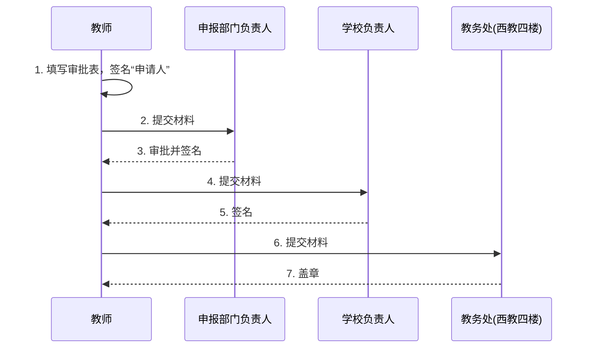
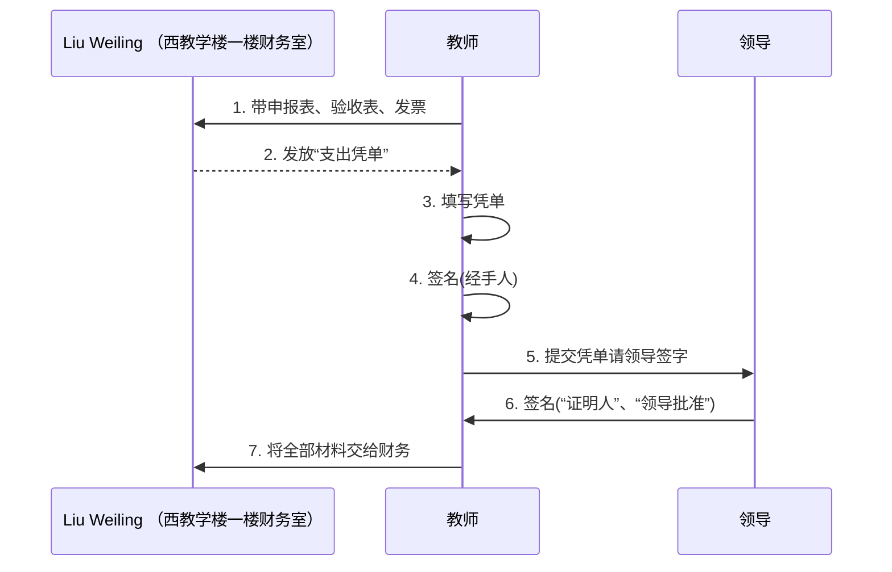

# 采购事项（dgscpzx）

## 申报

:::danger

预算金额应为价格浮动留有余地（验收总额≤预算金额）

:::

审批表填写示例：

- 填写：日期、表格内容
- 留空：其他内容（批复编号、申报部门、金额单位等）

| 序号 | 采购项目名称 | 品牌 | 规格及技术参数 | 数量 | 预算单价 | 预算金额 |
| :---: | :--- | :--- | :--- | :---: | :---: | :---: |
| 1 | 水火箭尾翼 | 七波 | 1.25 L | 8 | 4.5 | 36 |
| 2 | 电工胶带 | 七波 | 1.5 cm | 8 | 4 | 32 |

采购金额合计（大写）：陆拾捌元整；小写：¥68.00

- 申请人：XXX
- 联系电话：

:::info 申报部门负责人

- 校本课程：蔡主任（西教学楼三楼教务处）
    - 校本课程：申报表交给蔡主任即可，他帮忙处理完剩下的流程。

:::

:::info 学校负责人（任一即可）

- 书记：西教学楼四楼书记办公室
- 校长：西教学楼四楼校长办公室

:::

## 采购

:::danger

购买前应确认是否能开发票。

:::

:::info 发票抬头：企业抬头（必须有单价和数量）

需以 pdf 格式打印发票，不能用图片打印。

:::

| 项目 | 内容（自行替换拼音内容） |
| :--- | :--- |
| **抬头** | dgscpzx |
| **税号** | 510001401004368 |
| **开户银行** | 东莞银行 cp 支行 |
| **银行账户** | 12441900G19151833Q |
| **企业电话** | 0769-82201212 |

## 验收

:::danger

表格中的项目与数量，一定要与发票相符。

:::

验收表填写示例：

- 填写：日期、表格内容
- 留空：其他内容（批复编号、申报部门、金额单位等）

| 序号 | 采购项目名称 | 品牌 | 数量 |
| :---: | :--- | :--- | :---: |
| 1 | 水火箭尾翼 | 七波 | 8 |
| 2 | 电工胶带 | 七波 | 8 |

- 验收人：**三位**老师签名

:::info 【验收表】由【审批表】修改而来

- 抬头：“申报审批表”改成“申报验收表”；
- 删除表格三列：“规格及技术参数”、“预算单价”、“预算金额”；
- 删除表格整行：采购金额合计（大写）：___ 元；小写：¥ __ . __；
- 修改:“申请人”改成 **“验收人”**，三位老师签名；
- 删除表格内容：**“申报部门负责人：”**、**“联系电话：”**；
- 删除表格单元格：**“校长办公室审批意见：”** 所在单元格

:::

## 报销

### 报销单张发票

:::danger 报销单张发票

部分信息被遗忘，待更新。

:::

:::note 支出凭单

- 填写：
    - 付给________款：填项目，如校本课程（水火箭制作与研究）
    - 计人民币（大写）：______整（精确到分）
    - ￥：______（精确到分）
    - 经手人：教师自己签名
    - 审批人：申报部门负责人签名
    - 证明人：学校负责人签名

- 其他不填。

:::

:::info 审批人

- 校本课程：蔡主任（西教学楼三楼教务处）
    - 校本课程：所有资料夹好交给蔡主任即可，他帮忙处理完剩下的流程。

:::

:::info 证明人

校本课程：未知待补充

:::

### 报销多张发票

:::note 支出凭单

- 填写：
    - 付给________款：填项目，如校本课程（水火箭制作与研究）
    - 计人民币（大写）：______整（精确到分）
    - ￥：______（精确到分）
    - 经手人：教师自己签名
    - 证明人：申报部门负责人签名
    - 领导批准：学校负责人签名

- 其他不填。

:::

:::info 证明人

- 校本课程：蔡主任（西教学楼三楼教务处）
    - 校本课程：所有资料夹好交给蔡主任即可，他帮忙处理完剩下的流程。

:::

:::info 领导批准

校本课程：未知待补充

:::
